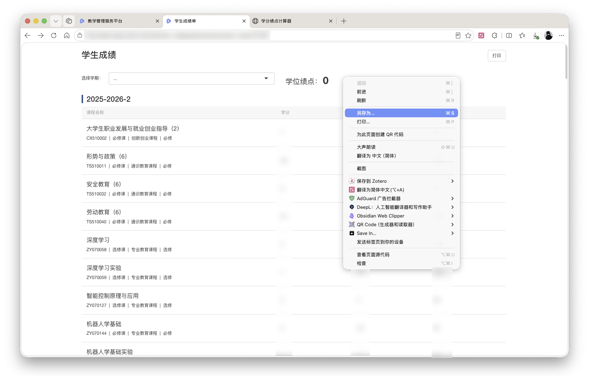
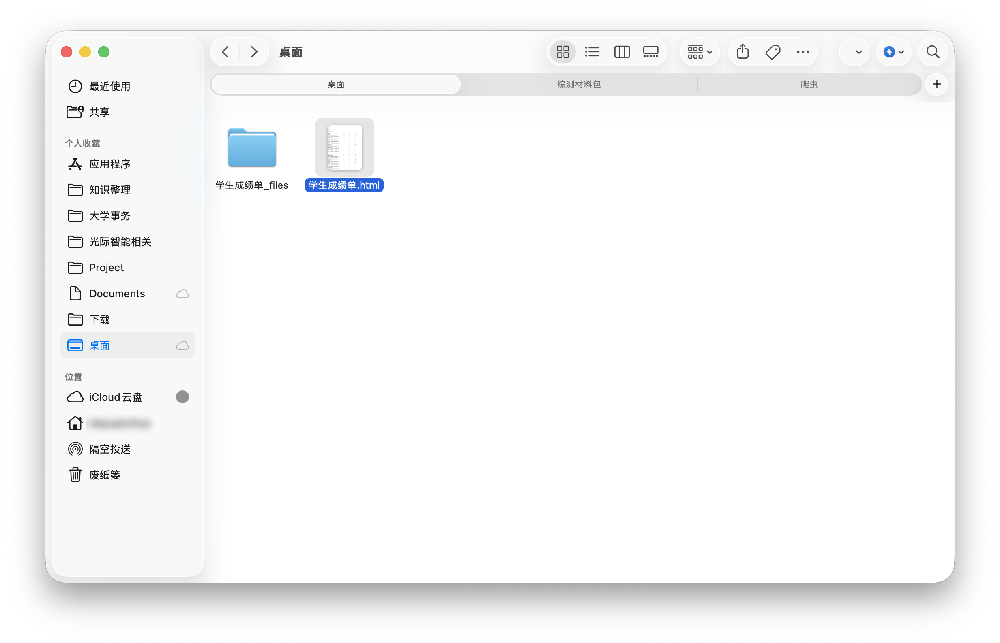
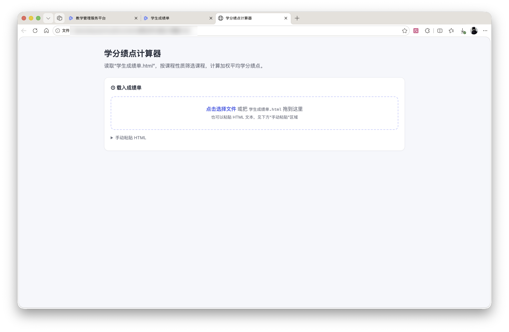
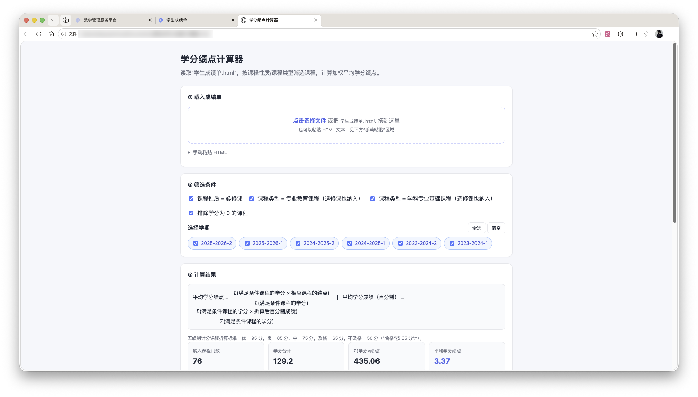
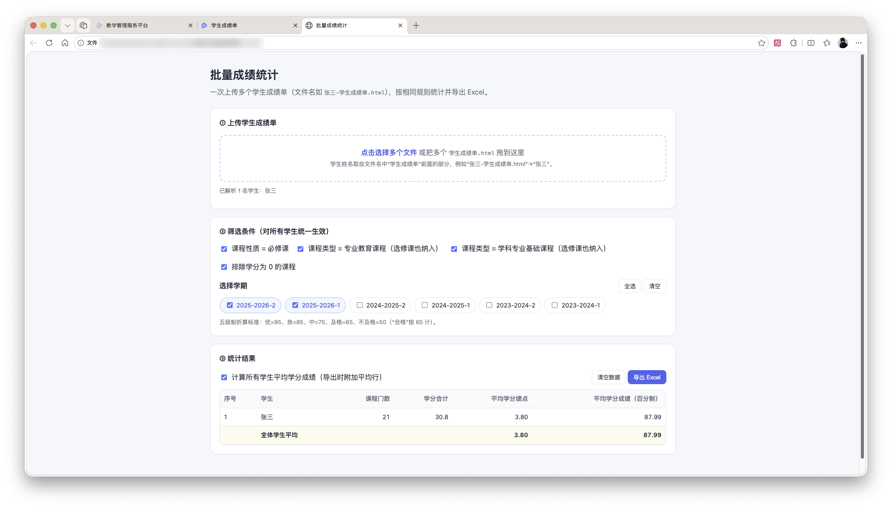

# 综合测评智育学分成绩计算器

## 项目简介

本项目为安庆师范大学综合测评智育成绩计算器，计算规则来自《安庆师范大学学生素质综合测评实施办法（修订）》2023 版，第三章 智育素质测评部分。

仓库地址：https://github.com/StuartXie/GPA-Calculator.git

国内镜像地址：https://gitee.com/stuartxie/GPA-Calculator.git

## 免责声明

1. **非官方工具**：本项目为个人开发的辅助工具，与安庆师范大学及其任何部门无关，不代表学校官方立场。
2. **计算结果仅供参考**：本工具依据《安庆师范大学学生素质综合测评实施办法（修订）》2023 版第三章智育素质测评部分编写，但办法解释权归学校所有。计算结果不构成任何官方认定，最终成绩以学校教务系统、学工系统及学院公示为准。
3. **数据安全自负**：本工具为纯前端 HTML 页面，所有计算均在本地浏览器中完成，不会上传或存储任何成绩数据。但使用者仍需自行妥善保管成绩单文件，因文件泄露或误操作造成的后果由使用者自行承担。
4. **使用风险自负**：使用者应自行核对输入数据与计算结果的准确性。因使用本工具导致的任何成绩认定偏差、评奖评优影响或其他损失，作者不承担任何责任。
5. **规则变动不另行通知**：若学校后续修订综合测评办法，本工具不保证同步更新，作者无义务提供维护或更新。
6. **许可证**：本项目采用 MIT 许可证，在遵守许可证的前提下可自由使用、修改和分发。

## 下载

直接下载 **学分成绩计算器.html** 即可。

针对需要批量计算的情况，可以下载 **批量成绩统计.html**。

## 使用方法

1. 进入学工系统的学生成绩页面。

   

2. 右键保存（另存为），下载得到网页“学生成绩单.html”。

   

     
     
   

3. 打开学分成绩计算器，直接将“学生成绩单.html”拖入网页。

   

4. 选择学期，如 2025-2026-2、2025-2026-1，即可得到 2025-2026 学年的平均学分成绩。

   

5. 可根据需要，选择包含在计算中的课程。

6. 若使用批量成绩统计，需要将每位学生的成绩命名为 “xxx-学生成绩单.html”。

   

> 在遵守 MIT 许可证的前提下，可根据自身需要修改代码。